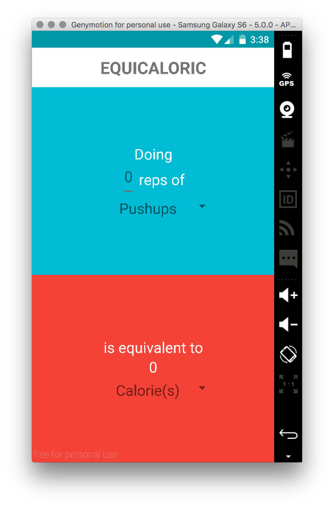
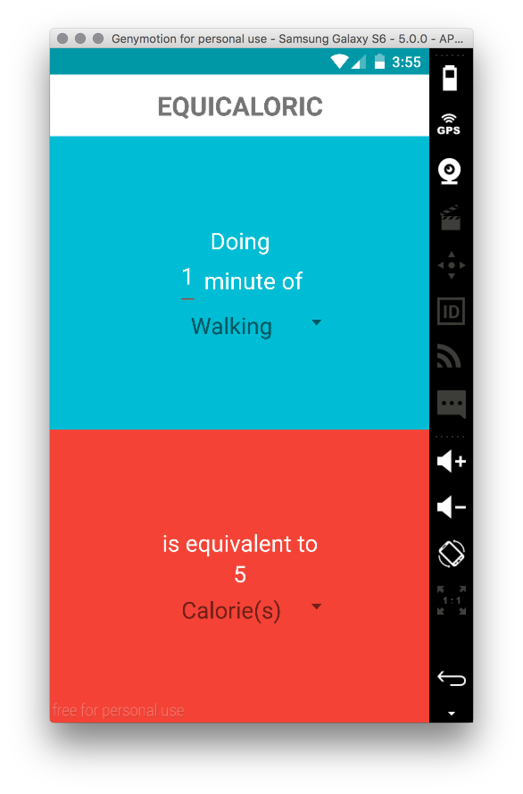
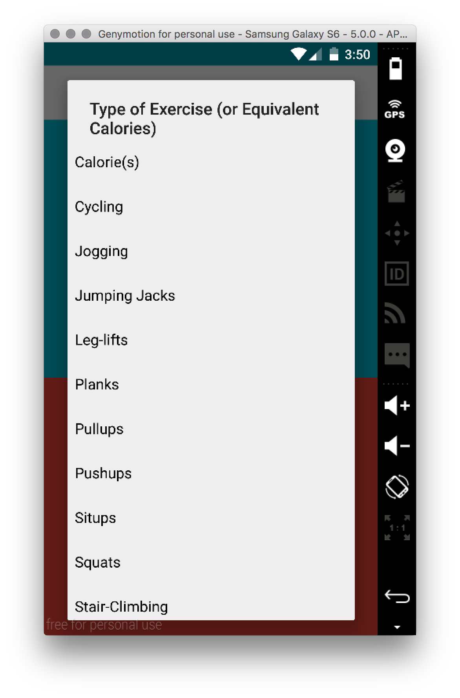
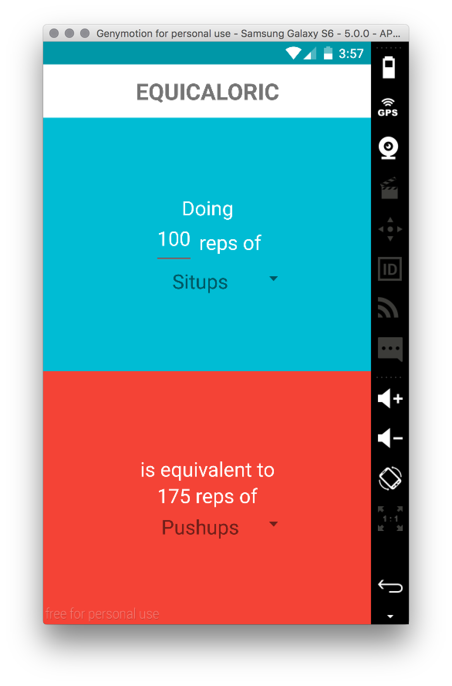

# PROG 01: Crunch Time

Equicaloric is a calorie burning conversion app designed to make planning and keeping track of your personal health & fitness easy.

The application itself is simple to use. In the top half of the app, simply input the number of reps you completed or the amount of time (in minutes) you exercised for in the first field, and change the second field, a dropdown, to the specific form of exercise.

By default, the bottom half should now display the number of calories that were burned. Alternatively, you can use the dropdown on the bottom to select another form of exercise to see its equivalent amount to your workout (for example, you can see that 100 situps burns around the same amount of calories as 175 pushups).

In addition, you can select “Calorie(s)” in the top half to see how much of some exercise you would need to do in order to burn that many.

## Authors

Ethan Chiou ([ethanchiou@berkeley.edu](mailto:ethanchiou@berkeley.edu))

## Demo Video

See [Equicaloric](https://youtu.be/5hw9d4Nd7_s)

## Screenshots

## Acknowledgments

Thanks to Google for giving me nice colours to use from the Material Design docs.
